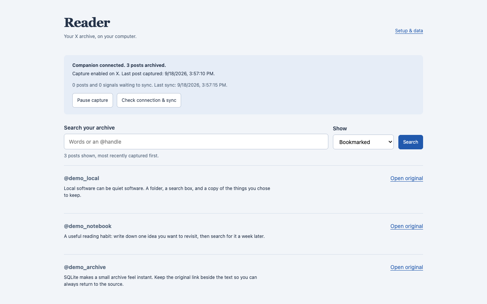

# Reader

A local, searchable archive of X posts. A Chrome extension captures posts as you browse; a Python companion stores them in SQLite.

Search text and author handles, filter by read/bookmarked/liked, and open the original post. Pause capture, export JSON, or delete the archive from the extension.



## Setup

Requires Chrome 120+ and Python 3.10+ with SQLite FTS5. No Python packages or build step needed.

1. Download this repository with **Code → Download ZIP** and unzip it into a permanent folder.
2. Open a terminal in that folder and run:

   ```sh
   python3 scripts/companion.py
   ```

   On Windows, use `py -3 scripts/companion.py`. The included `Start Reader.command` (macOS) and `Start Reader.bat` (Windows) run the same Python script. Keep the terminal open; Ctrl+C stops it. Run it again after reboot.
3. Open `chrome://extensions`, enable **Developer mode**, choose **Load unpacked**, and select `extension/`.
4. In Reader, click **Check connection & sync**, enable capture, reload X, and scroll.
5. Open Reader's toolbar icon to search the archive.

Capture starts paused. It saves posts loaded by X, including some you may not read. A post counts as read after 1.8 seconds at half visibility. Scroll bookmarks or likes to capture older posts. There is no automatic history backfill.

## Data and recovery

- **Storage:** `data/reader.db` in the companion folder. Set `READER_DB` to use another path. Keep this folder out of cloud sync if you want the archive to stay on one machine.
- **Disconnected:** Start the companion and check the connection. Port `8787` must be available. If capture is enabled but nothing appears, reload X and scroll.
- **Offline queue:** Chrome keeps up to 5,000 posts, 5,000 signals, and about 6 MiB pending. Oldest queued items are dropped when full; Reader shows the count. Sync retries about every 30 seconds while Chrome runs. Large queues may need several attempts.
- **Export:** Sync first, then export JSON from Setup & data. Unsynced captures are excluded. JSON re-import is not supported. For a restorable backup, stop the companion and copy the SQLite file.
- **Delete:** Type DELETE in Setup & data to clear the X archive, queue, and counters. Capture stays paused. If the companion is offline, reconnect and retry to finish deleting the database. Exports, backups, and other profiles' queues remain.
- **Uninstall:** Removing the extension leaves the database. Stop the companion, then remove `data/reader.db` and any `reader.db-*` sidecars to delete it manually.

Data is not encrypted by Reader. The companion listens only on loopback and rejects ordinary website origins, but other local programs or extensions can access it. Do not expose it through a tunnel or public network. See [Privacy](PRIVACY.md).

## Updating

Sync pending captures, stop the companion, and back up `data/`. Replace the program files in the same folder, preserving `data/`. Click **Reload** for Reader in `chrome://extensions`, restart the companion, and reload X. Unpacked extensions do not update automatically.

## Command line and Instagram

```sh
python3 scripts/query.py "sqlite"
python3 scripts/query.py --tier bookmarked -n 50
python3 scripts/coverage.py
```

To import Instagram saved posts, request a Meta JSON export and run:

```sh
python3 scripts/ingest_instagram.py /path/to/export/your_instagram_activity
python3 scripts/query.py --ig "recipe"
```

`--include-likes` is optional. Instagram uses `data/instagram.db`; the extension's search, export, and delete controls do not access it. Delete that database and the original export separately. Meta exports may contain links without post text.

## Limits

X can change its response format and break capture. Only posts loaded in your browser are available, and unliking or unbookmarking does not remove historical signals. Media files are not downloaded. There are no accounts, remote sync, analytics, or classification.

Tests cover synthetic capture and the Chrome extension flow, including offline recovery and browser restart. Current authenticated X behavior, Windows/Linux launchers, and opening downloaded scripts on macOS have not been verified. ChromeOS is not supported by these setup instructions. Large exports are assembled in memory and have not been load-tested.

## Development

Python standard library and plain JavaScript. Tests also require Node.js 20+.

```sh
./run-tests.sh
python3 scripts/package_release.py
```

Packaging creates `dist/reader-0.2.0.zip`, component ZIPs, and `SHA256SUMS` from explicit file lists. The component ZIPs contain only the extension or companion and must be used together. It excludes databases, exports, tests, and git history.

For browser tests, install the optional `playwright` Python package and its Chromium browser, then run `python3 tests/browser_smoke.py`. Port 8787 must be free. The test uses a temporary profile and synthetic X responses, and updates the screenshots. Set `READER_CHROME` to a Chrome for Testing executable if needed. `python3 tests/companion_smoke.py` tests the packaged companion. Icon generation uses Pillow: `python3 scripts/build_assets.py`.

[MIT license](LICENSE). [Report an issue](https://github.com/jdubba1/reader/issues) without attaching private posts, exports, or credentials.
